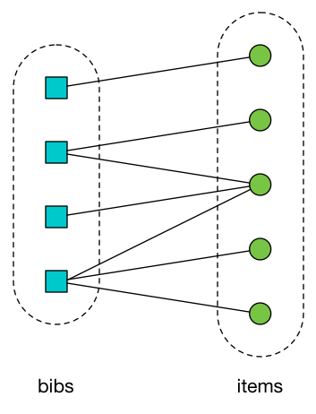

# sierra\_adapter

This stack is responsible for reading records from [Sierra](https://www.iii.com/products/sierra-ils/) \(our library management system\) and copying them into DynamoDB.

Since Sierra records are constantly being edited, it is also responsible for keeping DynamoDB up-to-date with new edits or additions.

## Shape of the data

Sierra has multiple types of record. We're interested in _**bibs**_ and _**items**_.

* A _bib_ is a _bibliographic record_ -- an individual book, for example. It's the "concept" of the book, rather than a physical copy.
* An _item_ is a physical object -- a copy of a book, for example. An item is something that can be physically ordered in the library.

For example, _On the Origin of the Species_ might have a single bib record \(because it's one book\), but multiple item records if there are multiple copies in the library.

A bib has one or more associated items \(the physical copies of that bib\). An item may be associated with one or more bibs.



In the terminology of graph theory, bibs and items form a [bipartite graph](https://en.wikipedia.org/wiki/Bipartite_graph).

In our ontology, we don't have bibs or items -- we have _**Works**_. Each bib and its associated items form a single work. For example, in the diagram above, there are four works, with 1, 2, 1 and 3 items, respectively.

## Shape of the API

The Sierra API allows you to request bibs or items separately -- but you can't make compound queries, for example, "bibs and their associated items".

Our adapter has to request bibs and items separately, then merge them into unified records before sending them to the Catalogue Pipeline. In the API results, item records contain a pointer to their associated bib records.

Our Sierra instance has over a million records \(closer to two!\). We don't want to pull them in all at once -- that would swamp the pipeline, and cause unnecessary strain on Sierra. The API allows us to [filter for records that were updated in a specific time frame](https://techdocs.iii.com/sierraapi/Content/zReference/queryParameters.htm), so we do that -- every time we fetch new records from Sierra, we only fetch records that were updated since our last fetch.

## Adapter architecture

The architecture is prone to change. It was correct at time of writing \(10 Jan 2018\).

### Generating update windows

In the adapter, a _**window**_ is a time frame with a start and an end. It describes a collection of updates that we're going to fetch from Sierra.

This is an example window, covering a 20 minute period:

```javascript
{
  "start": "2018-01-10T09:11:40.711539+00:00",
  "end": "2018-01-10T08:51:40.711539+00:00"
}
```

These windows are created by the _**sierra\_window\_generator**_. This is a Lambda triggered by a CloudWatch event rule \(like cron for AWS\). When the Lambda is run, it sends a window to an SNS topic, which in turns is copied to an SQS queue.


Because bibs and items are requested separately, we have two instances of the generator running: one for each. This allows us to have a different window size/frequency for bibs/items if we think it's useful.

### Reading records from Sierra

The window queue is read by the _**sierra\_reader**_ service. It pops a window from the queue, and requests bib/item records from Sierra that were updated in that window.

Requests to the Sierra API are sequential -- you can't ask for page _N_ before you have page _N-1_ -- so we can't parallelise reading within a single window. We want to get out of the reader as quickly as possible, so we do minimal processing here, and save the records as JSON files straight into S3. Each file contains multiple records, to reduce the number of S3 requests we need.

We use the event stream of PUT requests in S3 to trigger a splitter Lambda. This reads the batch files from S3, and separates them into individual records. It pushes the individual records to SNS/SQS.


If the reader is interrupted mid-window \(e.g. if the Sierra API times out\), the files in S3 form a progress meter. Rather than replaying the entire window, it can read the last batch from S3, and pick up where it left off.

As before, we run two copies of this step: one for bibs, one for items.

### Creating the Sierra API credentials

At time of writing \(2 April 2019\), the API credentials for the Sierra adapter are owned by [wellcomedigitalplatform@wellcome.ac.uk](mailto:wellcomedigitalplatform@wellcome.ac.uk). To create new credentials, or revoke an existing API key:

1. Log in to Sierra API console \(you need an admin account; contact Library Systems Support\)
2. Select "Sierra API keys"
3. Create a new key with the **bibs read** and **items read** permissions

